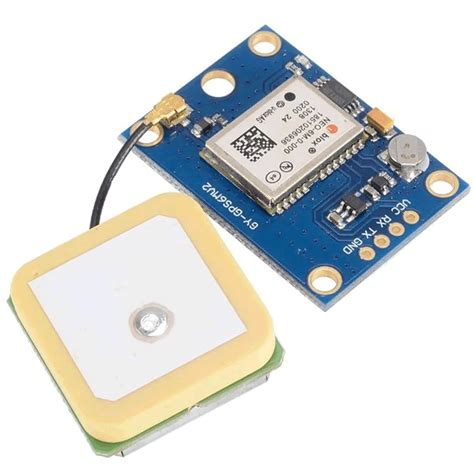
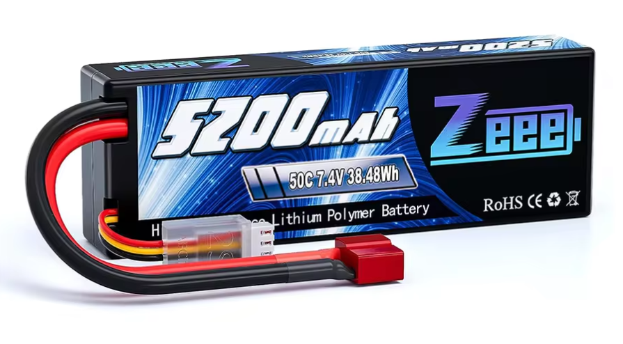

# 🛸 PEMY - Dron Autònom Intel·ligent

## 📚 Índex

- [📌 Què és PEMY?](#-què-és-pemy)
- [⚙️ Instal·lació del projecte](#️-instal·lació-del-projecte)
- [💻 Programari utilitzat](#-programari-utilitzat)
- [🔩 Components a destacar](#-components-a-destacar)
- [📊 Diagrama de flux](#-diagrama-de-flux)
- [🧩 Interconnexió entre dispositius](#-interconnexió-entre-dispositius)
- [🧠 Algorísmica](#-algorísmica)
  - [🎯 Objectiu](#objectiu)
  - [📈 Passos](#passos)
  - [📋 Exemple d’instruccions generades](#exemple-dinstruccions-generades)
- [🎥 Resultat final](#-resultat-final)

## 📌 Què és PEMY?

**PEMY** és un projecte de robòtica que té com a objectiu la construcció d’un **dron autònom** capaç de **seguir una persona vestida amb roba vermella**, **gravar vídeo** i **mantenir una distància òptima** mitjançant **visió per computador** i control dinàmic del vol. Tot el sistema funciona de manera independent i pot adaptar-se a diferents entorns sense necessitat d’intervenció manual.

---

## ⚙️ Instal·lació del projecte


---

## 💻 Programari utilitzat

- **Fritzing**: Creació del diagrama d’interconnexió dels components electrònics.
- **OpenCV / cv2**: Processament d’imatges en temps real.
- **FreeCAD**: Modelatge 3D del cos del dron.
- **Mission Planner**: Configuració de missions i monitoratge del dron.
- **ArduPilot + MAVLink**: Comunicació entre el sistema de control (Raspberry Pi) i la controladora de vol.

---

## 🔩 Components a destacar

- **Raspberry Pi Zero 2 W** – Còr del sistema intel·ligent.
- 

- **Raspberry Pi Camera UC-261 RGV.D** – Enregistrament de vídeo i detecció visual.
- 

- **Omnibus F4 V3S Plus** – Controladora de vol compatible amb ArduPilot.
- 

- **Mòdul GPS GY-NEO6MV2** – Localització en temps real.
- 

- **Bateria LiPo 7.4V** – Alimentació dels motors i controladora.
- 

- **Motors Brushless 1000KV amb ESCs de 30A** – Propulsió i maniobrabilitat.
- 

---

## 📊 Diagrama de flux


## 🧭 Arquitectura del Sistema de Vol Autònom

Aquest diagrama representa el flux de treball del sistema de control autònom d’un dron basat en Raspberry Pi, ArduPilot i MAVLink, incloent fases de configuració, control i processament de vídeo.


### 🧱 Components principals

* **ArduPilot**: Firmware de control de vol carregat a la controladora (FC).
* **Mission Planner (MP)**: Programari de configuració per calibrar sensors, definir paràmetres i preparar el dron abans del vol.
* **MAVLink**: Protocol de comunicació que connecta la Raspberry Pi amb la controladora de vol.
* **Raspberry Pi**: Unitat de processament que executa el control autònom i el processament de vídeo en temps real.

---

### 🔀 Flux detallat

1. **Configuració a terra (Mission Planner)**

   * **Calibratge**: Es calibren l'acceleròmetre, la brúxola, els giroscopis, els ESCs, etc.
   * **Configurar paràmetres**: S’ajusten valors com el tipus de frame, funcions dels servos, failsafes i opcions com desactivar l'ús obligatori del GPS.

2. **Inici a la Raspberry Pi**

   * **Pre-flight checks**: Validació de paràmetres i sensors mitjançant MAVLink abans d’autoritzar l’armat.
   * **Vídeo en directe**: El mòdul de càmera transmet vídeo en viu des del dron.
   * **Processament de vídeo**: Algoritmes en Python detecten obstacles, seguiment visual o altres tasques de navegació assistida.

3. **Canvi de mode de vol**

   * S’estableix el mode de vol (com `STABILIZE`, `GUIDED_NOGPS`, etc.) amb comandes MAVLink.

4. **Armat del dron**

   * S’activen els motors per permetre el vol.
   * Pot fer-se automàticament des de la Raspberry o manualment.

5. **RC Override**

   * La Raspberry controla directament el moviment del dron mitjançant override dels canals RC (throttle, pitch, roll, yaw).

6. **Enlairament**

   * El dron s’enlaira amb comandes programades o mitjançant una seqüència d’override.

7. **Vol**

   * Durant el vol, la Raspberry pot aplicar **correccions** en temps real, ja sigui per sensors o processament de vídeo.

8. **Descens**

   * S’inicia una maniobra d’aterratge suau, també mitjançant override o reducció del throttle.

9. **Desarmat**

   * Es desactiven els motors de manera segura després de l’aterratge.

---

### 🛠️ Notes addicionals

* L’ús de **STABILIZE + RC override** permet vols autònoms sense necessitat de GPS ni radiocontrol.
* El flux està dissenyat per funcionar amb drons configurats amb **sortides PWM estàndard (M1-M4)** i sense intervenció humana directa durant el vol.
* Tot el sistema s’executa automàticament en iniciar la Raspberry, permetent un dron completament autònom.

---

## 🧩 Interconnexió entre dispositius


### 🔋 1. Bateria LiPo (7,4V - 2S)
- **Funció:** Subministra energia a tot el sistema.
- **Sortida:** 7,4 volts directes.

### 🔌 2. Interruptor general (ON/OFF)
- **Funció:** Permet tallar l'alimentació de manera segura.
- **Connexió:**
  - El pol positiu (+) de la bateria passa **primer** per l’interruptor.
  - L'interruptor envia el corrent cap a una **plaqueta de distribució d’energia (PDB)** o directament als **ESCs** si no s’utilitza PDB.

### 🔄 3. ESCs (Electronic Speed Controllers) – 30A
- **Funció:** Controlen els motors brushless segons els senyals rebuts des de la controladora de vol.
- **Connexions de cada ESC:**
  - **Entrada de potència:** (+) i (−) des de la PDB o directament des de la bateria.
  - **Senyal (PWM):** Ve de la **controladora de vol (Omnibus F4 V3S Plus)**.
  - **Sortida:** 3 fils cap al motor brushless corresponent.

### ⚙️ 4. Motors brushless 1000KV
- **Funció:** Proporcionen la propulsió del dron.
- **Connexió:** 3 cables de fase per a cada motor que van directament a un ESC.
- *Nota:* L'ordre dels cables pot afectar el sentit de gir (es pot invertir canviant dues fases).

### 🧠 5. Controladora de vol - Omnibus F4 V3S Plus
- **Funció:** Coordina els moviments del dron (rotació, estabilitat, etc.).
- **Connexions:**
  - **PWM OUT:** cap als 4 ESCs (un per motor).
  - **UART/USB:** per comunicar-se amb la **Raspberry Pi** via MAVLink.
  - **Connexió GPS:** entrada UART des del mòdul GPS.
  - **Baròmetre intern i sensors IMU integrats.**

### 📷 6. Raspberry Pi Zero 2 W
- **Funció:** Executa l’algoritme de visió per computador (OpenCV) i envia ordres de moviment a la controladora de vol.
- **Connexions:**
  - **Port CSI:** per connectar la càmera Pi Camera V2.
  - **Port UART (GPIOs):** per comunicar-se amb la controladora de vol (via MAVLink).
  - **Alimentació:** mitjançant regulador de tensió de 5V si es vol alimentar directament des de la PDB o bateria.

### 🛰️ 7. Mòdul GPS GY-NEO6MV2
- **Funció:** Proporciona ubicació i velocitat al sistema.
- **Connexió:**
  - **Tx/Rx** a un port UART de la controladora de vol.
  - **Alimentació:** 3.3V o 5V segons la versió (normalment 5V des de la mateixa placa F4).


---

## 🧠 Algorísmica

A continuació es descriu el funcionament del sistema de seguiment desenvolupat amb OpenCV:

### Objectiu:

Detectar un objecte de color vermell (persona amb roba vermella), estimar la seva **distància al dron**, calcular la seva **posició relativa** i determinar **moviments correctius** perquè el dron es mantingui a una distància òptima.

### Passos:

1. **Captura del vídeo**: S’obre un arxiu de vídeo i es llegeixen fotogrames un a un.

2. **Conversió de color**: Els fotogrames es converteixen a l’espai de color HSV per facilitar la detecció del vermell.

3. **Mascara del color vermell**: Es defineixen dos rangs de vermell i es combinen en una màscara binària.

4. **Filtrat de soroll**: Es fa servir morfologia (obertura i dilatació) per netejar la imatge i ressaltar els objectes rellevants.

5. **Detecció de contorns**:
   - Es busca el contorn més gran i es verifica si supera una àrea mínima (`MIN_AREA`).
   - Es calcula la **distància estimada** al subjecte segons la seva alçada visual (pix).
     ```python
     distancia = (alçada_real * focal) / alçada_bbox
     ```

6. **Càlcul de desplaçaments**:
   - **Lateral**: Desviació del centre de la persona respecte al centre del fotograma.
   - **Frontal**: Si la distància real és superior/inferior a la desitjada.
   - **Rotació**: Angle lateral calculat mitjançant `arctan2()`.

7. **Generació d’instruccions**:
   - El sistema decideix:
     - Si ha de **moure's lateralment**.
     - Si ha d’**acostar-se o allunyar-se**.
     - Si ha de **girar** per alinear la càmera.
   - Aquestes instruccions es mostren sobre el vídeo.

8. **Visualització**:
   - Es dibuixa una caixa al voltant del subjecte.
   - Es marquen els punts clau i es mostren textos amb les ordres calculades.
   - El resultat es guarda en un fitxer de vídeo (`output_deteccion.mp4`).

---

### Exemple d’instruccions generades:
```
 Mover 0.45 m a la derecha
 Mover 0.80 m hacia adelante
 Girar 12.7 grados a la izquierda
```

Aquestes dades es poden traduir a ordres MAVLink perquè el dron realitzi els ajustos de vol.

---

## 🎥 Resultat final

El vídeo processat conté totes les anotacions visuals i es desa automàticament al directori. Aquest arxiu serveix com a eina de validació per comprovar la precisió de la detecció i la resposta algorísmica del sistema.


#### Contribucions: 
- Fernando Luis Vilareño
- Carlos Garcia Calvo
#
#### Autors
- Pol Vila Simón
- Enric Ferrera González
- Miguel López Manzanares
- Yassin Nakmouche Sahli M'Ghaiti
